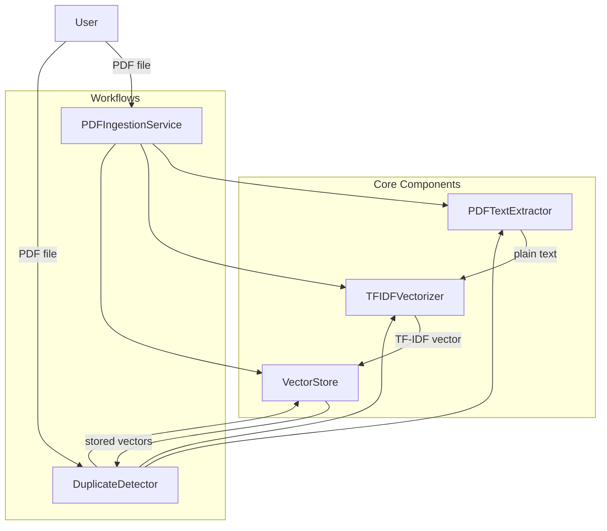

# Design Document: PDF Duplicate Detector

## Overview

The PDF Duplicate Detector is a Python-based system that identifies duplicate PDF documents by comparing their textual content using TF-IDF vectorization and cosine similarity. The system provides two primary workflows: **ingestion** (adding a document to the store) and **query** (checking if a duplicate exists).

The core pipeline is:

```
PDF → Text Extraction → Preprocessing → TF-IDF Vectorization → Vector Storage / Similarity Search
```

### Key Design Decisions

1. **Python with scikit-learn**: scikit-learn's `TfidfVectorizer` provides a battle-tested TF-IDF implementation with built-in cosine similarity support via sparse matrix operations. This avoids reinventing numerical computation.
2. **pdfplumber for PDF extraction**: pdfplumber offers reliable page-by-page text extraction with good handling of various PDF encodings and layouts. It's actively maintained and pure-Python.
3. **In-process vector store**: Since the requirements describe a simple system, we use an in-memory store backed by JSON persistence rather than a full vector database (e.g., ChromaDB, Pinecone). This keeps dependencies minimal and the system self-contained.
4. **Corpus refitting on ingestion**: Per requirement 2.3, the TF-IDF model refits on the full corpus when a new document is added. This means stored vectors are recomputed on each ingestion to maintain accurate term frequencies. For a simple system this is acceptable; for large-scale use, incremental approaches would be needed.

## Architecture



The architecture follows a pipeline pattern with four core components and two workflow orchestrators:

- **PDFTextExtractor** — Handles PDF parsing and text extraction
- **TFIDFVectorizer** — Manages text preprocessing and TF-IDF vector generation
- **VectorStore** — Persists document records and supports retrieval
- **PDFIngestionService** — Orchestrates the ingest workflow (extract → vectorize → store)
- **DuplicateDetector** — Orchestrates the query workflow (extract → vectorize → compare)

## Components and Interfaces

### PDFTextExtractor

Responsible for extracting text from PDF files.

```python
class PDFTextExtractor:
    def extract_text(self, pdf_path: str) -> str:
        """
        Extract all text from a PDF file, concatenating pages in order.

        Args:
            pdf_path: Path to the PDF file.

        Returns:
            Concatenated plain-text string from all pages.

        Raises:
            PDFExtractionError: If the file is invalid, corrupted, or contains no text.
        """
        ...
```

### TFIDFVectorizer

Manages TF-IDF model fitting and vector generation.

```python
from scipy.sparse import spmatrix

class TFIDFVectorizer:
    def fit_transform(self, corpus: list[str]) -> list[spmatrix]:
        """
        Fit the TF-IDF model on the full corpus and return vectors for all documents.

        Args:
            corpus: List of preprocessed text strings.

        Returns:
            List of sparse TF-IDF vectors, one per document.
        """
        ...

    def transform(self, text: str) -> spmatrix:
        """
        Transform a single document using the currently fitted model.

        Args:
            text: Preprocessed text string.

        Returns:
            Sparse TF-IDF vector.

        Raises:
            VectorizerNotFittedError: If the model has not been fitted yet.
        """
        ...

    def preprocess(self, text: str) -> str:
        """
        Apply text preprocessing: lowercasing and whitespace normalization.

        Args:
            text: Raw text string.

        Returns:
            Preprocessed text string.
        """
        ...
```

### VectorStore

Persists document records and supports retrieval.

```python
from dataclasses import dataclass
from datetime import datetime
from scipy.sparse import spmatrix

@dataclass
class DocumentRecord:
    doc_id: str
    filename: str
    text: str
    vector: spmatrix | None
    ingested_at: datetime

class VectorStore:
    def add_document(self, record: DocumentRecord) -> str:
        """
        Store a document record. Raises if doc_id already exists.

        Args:
            record: The document record to store.

        Returns:
            The assigned document identifier.

        Raises:
            DuplicateIdentifierError: If a document with the same ID exists.
        """
        ...

    def get_all_documents(self) -> list[DocumentRecord]:
        """Return all stored document records."""
        ...

    def get_all_vectors(self) -> list[tuple[str, spmatrix]]:
        """Return list of (doc_id, vector) tuples for all stored documents."""
        ...

    def update_vectors(self, vectors: dict[str, spmatrix]) -> None:
        """
        Bulk update vectors for existing documents (used after refitting).

        Args:
            vectors: Mapping of doc_id to new TF-IDF vector.
        """
        ...

    def remove_document(self, doc_id: str) -> None:
        """Remove a document by ID. Used for rollback on failed ingestion."""
        ...

    def is_empty(self) -> bool:
        """Return True if the store contains no documents."""
        ...

    def document_count(self) -> int:
        """Return the number of stored documents."""
        ...
```

### DuplicateDetector

Computes similarity and determines duplicate status.

```python
@dataclass
class ComparisonResult:
    is_duplicate: bool
    highest_score: float
    matching_doc_id: str | None
    store_empty: bool

class DuplicateDetector:
    DUPLICATE_THRESHOLD: float = 0.98

    def compare(self, query_vector: spmatrix, stored_vectors: list[tuple[str, spmatrix]]) -> ComparisonResult:
        """
        Compare a query vector against all stored vectors using cosine similarity.

        Args:
            query_vector: TF-IDF vector of the query document.
            stored_vectors: List of (doc_id, vector) tuples from the store.

        Returns:
            ComparisonResult with duplicate status, score, and matching ID.
        """
        ...

    def cosine_similarity(self, vec_a: spmatrix, vec_b: spmatrix) -> float:
        """
        Compute cosine similarity between two sparse vectors.

        Returns:
            Float between 0.0 and 1.0.
        """
        ...
```

### PDFIngestionService

Orchestrates the full ingestion pipeline.

```python
@dataclass
class IngestionResult:
    doc_id: str
    message: str

class PDFIngestionService:
    def ingest(self, pdf_path: str, filename: str) -> IngestionResult:
        """
        Full ingestion pipeline: extract text → vectorize → store.
        Rolls back on failure to prevent partial data.

        Args:
            pdf_path: Path to the PDF file.
            filename: Original filename for the record.

        Returns:
            IngestionResult with assigned doc_id and confirmation.

        Raises:
            IngestionError: If any pipeline step fails.
        """
        ...

    def query(self, pdf_path: str) -> ComparisonResult:
        """
        Full query pipeline: extract text → vectorize → compare.
        Does not modify the store.

        Args:
            pdf_path: Path to the query PDF file.

        Returns:
            ComparisonResult indicating duplicate status.
        """
        ...
```

## Data Models

### DocumentRecord

| Field        | Type              | Description                                    |
|-------------|-------------------|------------------------------------------------|
| `doc_id`    | `str`             | Unique identifier (UUID4)                      |
| `filename`  | `str`             | Original PDF filename                          |
| `text`      | `str`             | Extracted plain text (stored for refitting)     |
| `vector`    | `spmatrix \| None` | TF-IDF sparse vector (None before first fit)   |
| `ingested_at` | `datetime`      | UTC timestamp of ingestion                     |

### ComparisonResult

| Field            | Type          | Description                                         |
|-----------------|---------------|-----------------------------------------------------|
| `is_duplicate`  | `bool`        | True if highest score ≥ 0.98                        |
| `highest_score` | `float`       | Highest cosine similarity score (0.0–1.0)           |
| `matching_doc_id` | `str \| None` | ID of the best match, or None if no duplicate      |
| `store_empty`   | `bool`        | True if the vector store was empty during comparison |

### IngestionResult

| Field     | Type  | Description                          |
|----------|-------|--------------------------------------|
| `doc_id` | `str` | Assigned document identifier         |
| `message` | `str` | Confirmation or status message       |

### Persistence Format (JSON)

The vector store persists to a JSON file with this structure:

```json
{
  "documents": [
    {
      "doc_id": "uuid-string",
      "filename": "report.pdf",
      "text": "extracted text content...",
      "ingested_at": "2024-01-15T10:30:00Z"
    }
  ]
}
```

Vectors are not persisted to JSON directly (sparse matrices are recomputed on load by refitting the TF-IDF model on all stored texts). This ensures vector consistency and avoids complex serialization of sparse matrices.


## Correctness Properties

*A property is a characteristic or behavior that should hold true across all valid executions of a system — essentially, a formal statement about what the system should do. Properties serve as the bridge between human-readable specifications and machine-verifiable correctness guarantees.*

### Property 1: Text preprocessing normalizes case and whitespace

*For any* input string, the `preprocess` function SHALL return a string that is entirely lowercase and contains no leading, trailing, or consecutive whitespace characters.

**Validates: Requirements 2.2**

### Property 2: Vectorizer produces valid sparse vectors

*For any* non-empty text string (after preprocessing), the `TFIDFVectorizer.transform` method SHALL return a sparse vector with non-negative values and dimensions matching the fitted vocabulary size.

**Validates: Requirements 2.1**

### Property 3: Vectorization round-trip preserves term weights

*For any* valid text input, vectorizing the text to obtain term-weight pairs, then reconstructing a document from those term-weight pairs, then re-vectorizing SHALL produce an equivalent vector.

**Validates: Requirements 2.4**

### Property 4: Document store round-trip preserves all fields

*For any* valid DocumentRecord, storing it in the VectorStore and then retrieving all documents SHALL yield a record with the same doc_id, filename, text, and ingested_at values. Furthermore, storing N documents and retrieving all SHALL yield exactly N records.

**Validates: Requirements 3.1, 3.2, 3.4**

### Property 5: Duplicate identifier rejection

*For any* DocumentRecord already stored in the VectorStore, attempting to store another record with the same doc_id SHALL raise a DuplicateIdentifierError.

**Validates: Requirements 3.3**

### Property 6: Cosine similarity score bounds

*For any* two non-negative sparse vectors (as produced by TF-IDF), the cosine similarity score SHALL be a float in the range [0.0, 1.0].

**Validates: Requirements 4.2**

### Property 7: Threshold classification correctness

*For any* ComparisonResult produced by the DuplicateDetector, `is_duplicate` SHALL be True if and only if `highest_score >= 0.98`. When `is_duplicate` is True, `matching_doc_id` SHALL be non-None. When `is_duplicate` is False, `matching_doc_id` SHALL be None.

**Validates: Requirements 4.3, 4.4**

### Property 8: Query does not modify store

*For any* VectorStore state and any query vector, performing a comparison operation SHALL leave the VectorStore contents identical to the state before the query — same document count, same doc_ids, same vectors.

**Validates: Requirements 6.3**

## Error Handling

### Custom Exceptions

| Exception                  | Raised By            | Condition                                      |
|---------------------------|----------------------|------------------------------------------------|
| `PDFExtractionError`      | PDFTextExtractor     | Invalid, corrupted, or unreadable PDF file     |
| `EmptyDocumentError`      | PDFTextExtractor     | PDF contains no extractable text               |
| `VectorizerNotFittedError`| TFIDFVectorizer      | `transform` called before `fit_transform`      |
| `DuplicateIdentifierError`| VectorStore          | Document with same ID already exists           |
| `IngestionError`          | PDFIngestionService  | Any pipeline step fails during ingestion       |

### Error Handling Strategy

1. **PDF Extraction Errors**: The `PDFTextExtractor` catches pdfplumber exceptions and wraps them in `PDFExtractionError` with a descriptive message including the filename and failure reason.

2. **Empty Document Detection**: After extraction, if the resulting text is empty or whitespace-only, `EmptyDocumentError` is raised before vectorization is attempted.

3. **Ingestion Rollback**: If vectorization or storage fails after text extraction, the `PDFIngestionService` removes any partially stored data from the `VectorStore` using `remove_document`. This ensures atomicity per requirement 5.3.

4. **Query Safety**: The query workflow catches all exceptions from extraction and vectorization, wrapping them in a clear error without modifying the store.

5. **Validation**: Input validation occurs at the boundary — `PDFTextExtractor` validates the file exists and is readable, `VectorStore` validates doc_id uniqueness before storage.

## Testing Strategy

### Property-Based Tests (using Hypothesis)

The project will use [Hypothesis](https://hypothesis.readthedocs.io/) for property-based testing. Each correctness property maps to a single property-based test with a minimum of 100 iterations.

| Property | Test Description | Key Generators |
|----------|-----------------|----------------|
| Property 1 | Preprocessing normalization | `st.text()` with mixed case and whitespace |
| Property 2 | Valid vector output | `st.text(min_size=1)` filtered to non-empty after preprocessing |
| Property 3 | Vectorization round-trip | `st.text(min_size=1)` with alphabetic characters |
| Property 4 | Store round-trip | Random `DocumentRecord` instances with `st.uuids()`, `st.text()`, `st.datetimes()` |
| Property 5 | Duplicate ID rejection | Random `DocumentRecord` pairs sharing the same `doc_id` |
| Property 6 | Cosine similarity bounds | Random non-negative sparse vectors via `st.lists(st.floats(min_value=0))` |
| Property 7 | Threshold classification | Random `float` scores in [0.0, 1.0] with mock stored vectors |
| Property 8 | Query immutability | Random store states and query vectors |

Each test will be tagged with: **Feature: pdf-duplicate-detector, Property {number}: {property_text}**

### Unit Tests (using pytest)

Unit tests cover specific examples, edge cases, and integration points:

- **PDF Extraction**: Test with known PDF files (single page, multi-page, image-only, corrupted)
- **Empty Store Query**: Verify `store_empty=True` when querying an empty store (Req 4.5)
- **Ingestion Rollback**: Mock failures at each pipeline stage and verify store is unchanged (Req 5.3)
- **End-to-End Ingestion**: Ingest a known PDF and verify the full record in the store (Req 5.1, 5.2)
- **End-to-End Query**: Ingest documents, query with a known duplicate, verify result (Req 6.1, 6.2)
- **Corpus Refitting**: Ingest multiple documents and verify vectors are recomputed (Req 2.3)

### Test Configuration

- **Framework**: pytest with pytest-hypothesis
- **PBT iterations**: Minimum 100 per property (`@settings(max_examples=100)`)
- **Coverage target**: All acceptance criteria covered by at least one test (property or unit)
- **Mocking**: Use `unittest.mock` for PDF file I/O in property tests; test pure logic directly where possible
